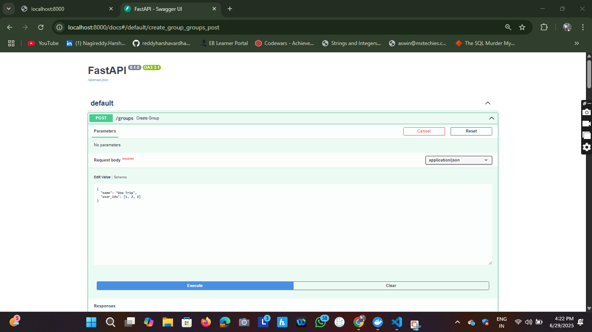
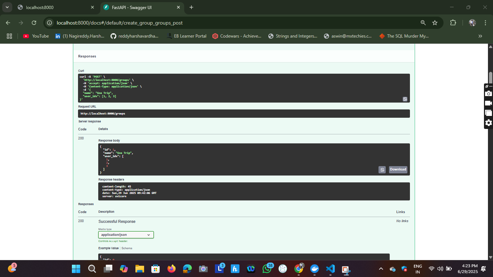
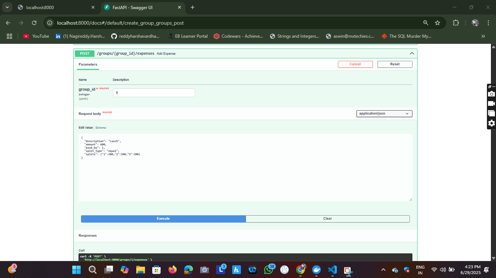
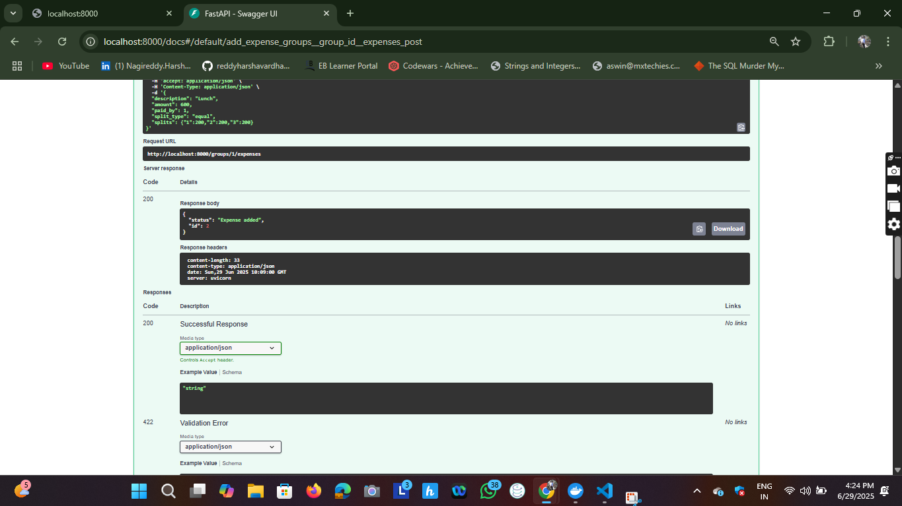
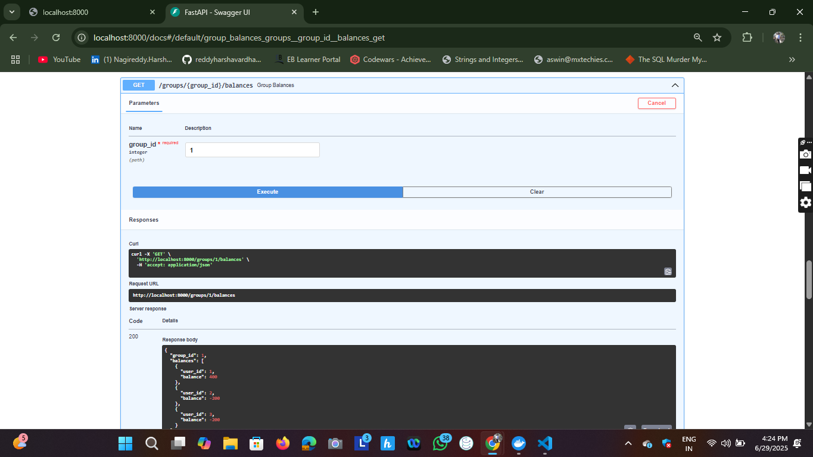
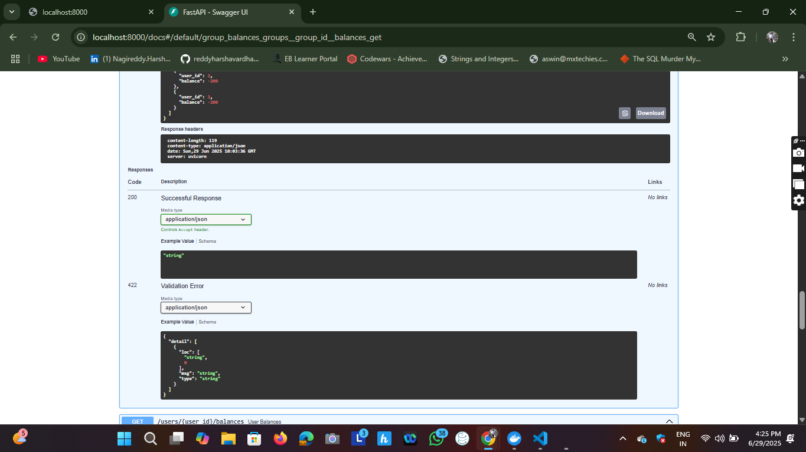
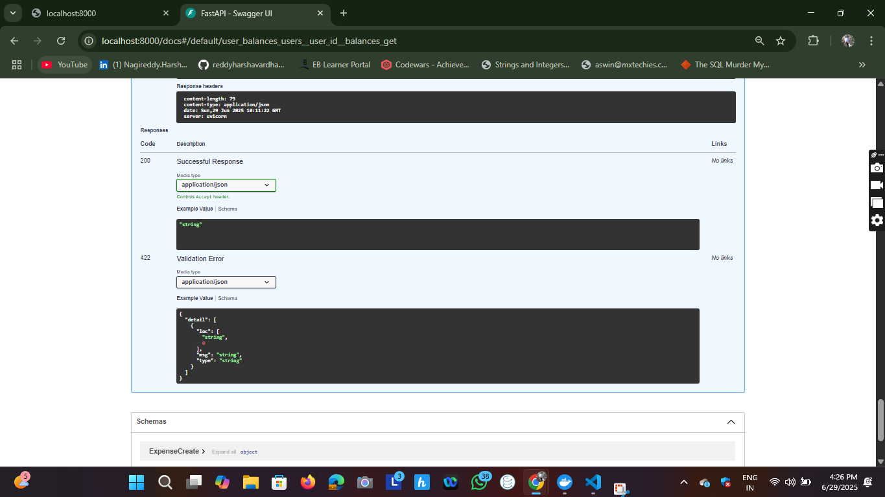

# 💸 Splitwise Clone

A simple Splitwise-style application for managing group expenses, built with **FastAPI + PostgreSQL (backend)** and **React + TailwindCSS (frontend)**.

---

## 🚀 Features

- ✅ Create groups with multiple users  
- ✅ Add expenses (equal and percentage split)  
- ✅ Track group and individual user balances  
- ✅ RESTful API documented with Swagger UI  
- ✅ Dockerized for easy local development

---

## 🧱 Project Structure

```
splitwise-clone/
├── backend/             # FastAPI app
├── frontend/            # React app
└── docker-compose.yml   # Docker orchestration
```

---

## ⚡ Quick Start

### 🧰 Prerequisites

- [Docker](https://www.docker.com/get-started)  
- [Docker Compose](https://docs.docker.com/compose/)

### 🏃‍♂️ Run Everything (Single Command)

```bash
docker-compose up --build
```

- Backend: http://localhost:8000  
- Frontend: http://localhost:3000  
- PostgreSQL: localhost:5432

---

### 🧪 Insert Demo Data

In a new terminal:

```bash
docker-compose exec db psql -U postgres splitwise
```

Inside the `psql` shell:

```sql
INSERT INTO users (name) VALUES ('Alice'), ('Bob'), ('Charlie');
\q
```

---

## 🧾 API Documentation

Access Swagger UI:  
👉 [http://localhost:8000/docs](http://localhost:8000/docs)

### 🔑 Key Endpoints

#### 👥 Group Management

- **Create Group**
  ```http
  POST /groups
  ```
  **Sample JSON:**
  ```json
  { "name": "Goa Trip", "user_ids": [1, 2, 3] }
  ```

- **Get Group Details**
  ```http
  GET /groups/{group_id}
  ```

#### 💰 Expense Management

- **Add Expense to Group**
  ```http
  POST /groups/{group_id}/expenses
  ```

  **Equal Split:**
  ```json
  {
    "description": "Lunch",
    "amount": 600,
    "paid_by": 1,
    "split_type": "equal",
    "splits": {"1": 200, "2": 200, "3": 200}
  }
  ```

  **Percentage Split:**
  ```json
  {
    "description": "Dinner",
    "amount": 500,
    "paid_by": 2,
    "split_type": "percentage",
    "splits": {"1": 20, "2": 50, "3": 30}
  }
  ```

#### 📊 Balance Tracking

- **Group Balances**
  ```http
  GET /groups/{group_id}/balances
  ```

- **User Balances**
  ```http
  GET /users/{user_id}/balances
  ```

---

## 🎨 Frontend Overview

React + TailwindCSS interface with:

- Create/view groups  
- Add/view expenses  
- Track group and personal balances  

Visit: [http://localhost:3000](http://localhost:3000) (requires backend to be running)

---

## 📸 Screenshots

| browser page after clicking the link | entering the details | entering the details || entering the details |
|--------------|----------|-----------||-----------|
|   |  |  |  |

---

## 🔍 Assumptions

- Users are pre-created in the DB (no auth yet)  
- Splits must be explicitly provided (even for equal split)  
- No payment/settlement, only balance tracking  
- All API endpoints are public (for demo only)

---

## 🛠 Tech Stack

- **Backend**: FastAPI, PostgreSQL, SQLAlchemy  
- **Frontend**: React, TailwindCSS  
- **DevOps**: Docker, Docker Compose

---

## 📦 Deployment / Running Manually

```bash
# Run full stack
docker-compose up --build

# Run backend only
cd backend
uvicorn app.main:app --reload

# Run frontend only
cd frontend
npm start
```

---


